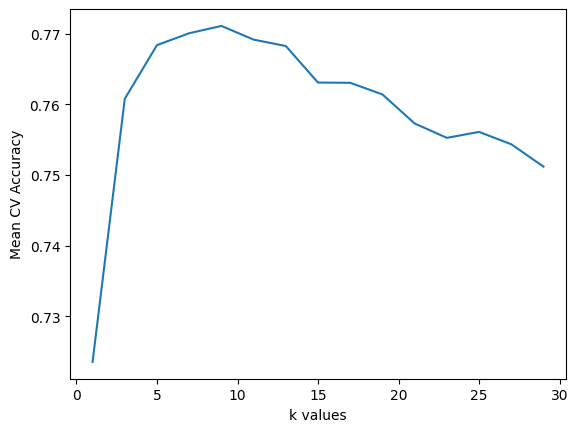
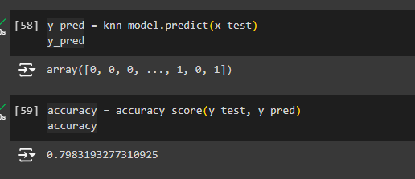

# Hackthonmerce v1.0

## To run
- Install requirements
- Activate venv
- Command: ```streamlit run main.py```

## Model KNN
### Pretrained Model
folder: ``server/models/trained/knn/pretrained.pkl``

### K values:


### Score:
- accuracy: 



## Documentation
- Read the documentation on ``docs`` folder.

## Note:
Load your datasets:
- Original data path: ``storage/datasets/ecommerce.csv``
- Preprocessed data path: ``storage/datasets/datasetpredictvente.csv``

## Contributors:
- Lazare
- Valentin
- Joel
- Asma